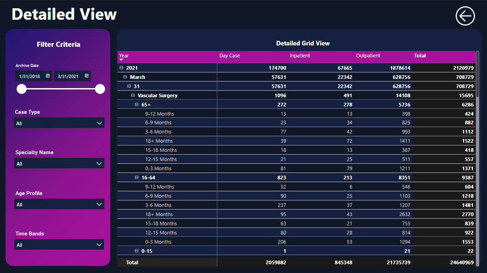

# Hospital Wait List Dashboard

## 📌 Overview
This project is a **multi-page interactive Power BI dashboard** designed to visualize and analyze data efficiently. It integrates multiple CSV datasets and provides users with summary insights and a detailed hierarchical tabular view.

## 📊 Preview




## 🛠 Features
- **Multi-Page Dashboard:**
  - **Page 1:** Summary dashboard with key performance indicators (KPIs) and visual insights.
  - **Page 2:** Detailed hierarchical tabular view for granular data analysis.
- **Interactivity:**
  - Multiple filters, dynamic tabs, and drill-down tooltips for enhanced data exploration.
  - Navigation buttons for seamless user experience.
- **Automated Data Refresh:**
  - Configured for scheduled refreshes to accommodate new data dynamically.

## 📂 Data Sources
- Multiple CSV files combined and cleaned to serve as the data source for visualization.

## 🚀 Getting Started
### Prerequisites
- Install **Power BI Desktop** ([Download Here](https://powerbi.microsoft.com/desktop/))

### Steps to Use
1. Clone this repository:
   ```bash
   git clone https://github.com/yourusername/powerbi-dashboard.git
   ```
2. Open the [.pbix](Healthcare%20Dashboard.pbix) file in Power BI Desktop.
3. Ensure the data sources are correctly linked and refresh the dataset.
4. Explore the interactive dashboard.

